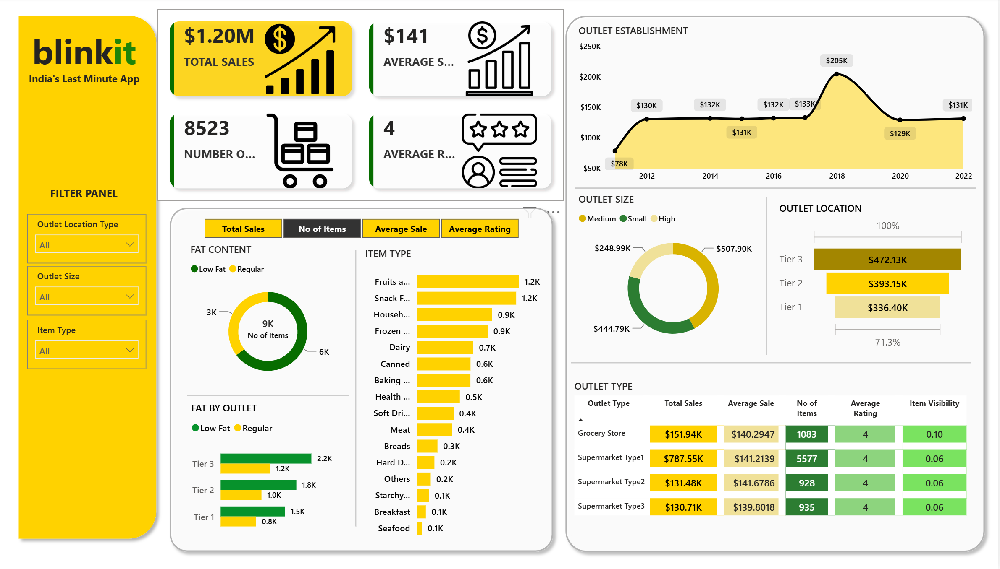

# 🛒 Blinkit Sales Analysis Dashboard

> Developed during my **AICTE – Edunet Foundation Virtual Internship**, where I applied data cleaning, data transformation, visualization, and business analytics concepts to analyze a retail sales dataset using Microsoft Excel and Power BI.

---

# 🎯 Business Challenge

Quick-commerce (Q-commerce) businesses operate on high order volumes with low profit margins. Making data-driven decisions is essential to improve operational efficiency and maximize profitability.

Some of the key business questions include:

- Which outlet locations generate the highest revenue?
- Which outlet sizes perform the best?
- Which product categories contribute the most sales?
- How does outlet age impact sales performance?
- Which products should be prioritized for inventory planning?

This project analyzes Blinkit's retail sales data to identify opportunities for improving sales performance and operational efficiency.

---

# 📊 Project Overview

### Objective

Analyze Blinkit's retail sales performance across different outlet types, outlet sizes, product categories, and locations to generate actionable business insights.

### Dataset

- **Industry:** Retail / Quick Commerce
- **Records:** 8,523
- **Product Categories:** 16
- **Outlet Types:** Grocery Store, Supermarket Type 1, Type 2 & Type 3
- **Outlet Locations:** Tier 1, Tier 2 and Tier 3
- **Metrics Analyzed:**
  - Total Sales
  - Average Sales
  - Average Rating
  - Number of Items
  - Item Visibility
  - Outlet Performance

---

# 🔍 Key Business Insights

## 1️⃣ Tier 3 Outlets Generated the Highest Sales

### Finding

Tier 3 outlets contributed the highest overall sales compared to Tier 1 and Tier 2 outlets.

### Business Impact

This suggests that expanding in Tier 3 cities can provide better revenue opportunities while potentially operating with lower costs.

### Recommendation

- Prioritize future outlet expansion in Tier 3 markets.
- Study successful Tier 3 outlets and replicate their operational strategies.

---

## 2️⃣ Medium-Sized Outlets Delivered Balanced Performance

### Finding

Medium-sized outlets achieved strong sales performance while maintaining operational efficiency.

### Business Impact

Increasing outlet size does not necessarily result in proportionally higher sales.

### Recommendation

- Focus on expanding medium-sized outlets.
- Optimize inventory based on outlet size.

---

## 3️⃣ Fruits & Vegetables and Snack Foods Were Top Performing Categories

### Finding

These categories contributed significantly to overall revenue.

### Business Impact

High-demand products should receive greater inventory allocation to minimize stock shortages.

### Recommendation

- Maintain sufficient inventory levels.
- Use promotional campaigns for complementary product categories.

---

## 4️⃣ Regular Fat Products Generated Higher Sales

### Finding

Regular-fat products accounted for a larger share of total sales compared to low-fat products.

### Business Impact

Customer demand currently favors regular-fat products.

### Recommendation

- Continue maintaining adequate inventory for high-demand products.
- Introduce targeted promotions to increase low-fat product sales.

---

## 5️⃣ Older Outlets Showed Better Sales Performance

### Finding

Outlets established earlier generally generated higher sales than recently opened outlets.

### Business Impact

Older outlets benefit from stronger customer loyalty and operational maturity.

### Recommendation

- Support newer outlets through promotional campaigns.
- Apply best practices from high-performing mature outlets.

---

# 💼 Business Applications

This dashboard can help management to:

- Monitor outlet performance
- Compare sales across locations
- Track product category performance
- Improve inventory allocation
- Support outlet expansion decisions
- Identify underperforming outlets

---

# 🛠 Technical Implementation

## Step 1: Data Cleaning (Microsoft Excel)

The dataset was cleaned using Microsoft Excel before importing it into Power BI.

Cleaning tasks included:

- Checked missing values
- Removed duplicate records
- Standardized categorical values
- Corrected inconsistent entries
- Validated numerical fields
- Verified outlet information

---

## Step 2: Data Transformation (Power Query)

Power Query was used to prepare the data for analysis.

Tasks performed:

- Changed data types
- Removed unnecessary columns
- Created calculated columns
- Cleaned categorical fields
- Optimized data model

---

## Step 3: Dashboard Development (Power BI)

Created interactive dashboards using:

- KPI Cards
- Donut Charts
- Bar Charts
- Line Charts
- Matrix Table
- Slicers
- DAX Measures

---

# 📊 Dashboard Architecture

### Design Principles

- Clean executive dashboard
- Interactive filtering
- Simple navigation
- Business-focused KPIs
- Consistent Blinkit-inspired color theme

### Dashboard Features

- Cross-filtering
- Dynamic slicers
- Interactive visuals
- Drill-down analysis
- Executive summary

---

# 📷 Dashboard Preview

## Executive Dashboard



---

# 📁 Repository Structure

```
Blinkit-Dashboard-Analysis/
│
├── data/
│   └── BlinkIT Grocery Data.xlsx
│
├── image/
│   └── dashboard.png
│
├── power bi/
│   └── Dashboard.pbix
│
└── README.md
```

---

# 📈 Dashboard KPIs

- 💰 Total Sales
- 📦 Number of Items
- ⭐ Average Rating
- 📊 Average Sales
- 🏪 Sales by Outlet Size
- 📍 Sales by Outlet Location
- 🥦 Sales by Item Type
- 📅 Sales by Outlet Establishment Year
- 🧈 Fat Content Distribution

---

# 💡 Business Recommendations

- Expand outlets in Tier 3 locations.
- Increase inventory for high-demand product categories.
- Improve performance of newer outlets through targeted marketing.
- Focus on medium-sized outlet expansion.
- Optimize inventory planning using historical sales trends.

---

# 📊 Expected Business Impact

The dashboard enables businesses to:

- Improve outlet-level decision making
- Increase operational efficiency
- Optimize inventory allocation
- Enhance sales monitoring
- Support strategic expansion planning

---

# 🎓 Skills Demonstrated

✅ Data Cleaning (Microsoft Excel)

✅ Data Transformation (Power Query)

✅ Data Modeling

✅ DAX Measures

✅ Power BI Dashboard Development

✅ KPI Design

✅ Retail Sales Analytics

✅ Business Intelligence

✅ Data Storytelling

---

# 📬 About This Project

This project demonstrates how business intelligence and retail analytics can support better decision-making through interactive dashboards and meaningful business insights.

The techniques used in this project can be applied to retail, e-commerce, grocery, and quick-commerce businesses.

---

## 👨‍💻 Author

**Vanshdeep Sharma**

Electronics & Communication Engineering Student

Aspiring Data Analyst

### Skills

Power BI • Excel • SQL  • DAX • Power Query

